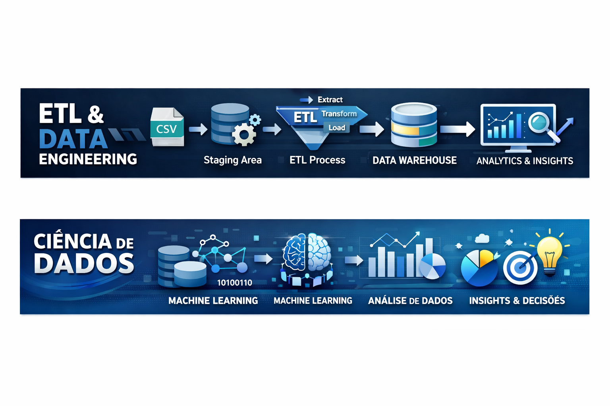

<div align="center">

# 📊 Data Pipeline & Analytics  
### Armazenamento, Manipulação e Transformação de Dados



Pipeline de dados desenvolvido para consolidação, tratamento e análise de dados de um marketplace, utilizando conceitos de **ETL**, **Data Warehouse** e **Modelagem Dimensional (Star Schema)**.

</div>

---

## 📌 Visão Geral

Este projeto simula um cenário real de engenharia de dados, no qual informações operacionais dispersas são transformadas em uma base analítica confiável, possibilitando análises estratégicas e suporte à tomada de decisão.

---

## ⭐ Metodologia STAR

### 🟢 **Situation — Situação**

Um marketplace armazena dados de pedidos, clientes e produtos em diferentes arquivos CSV, oriundos de múltiplos sistemas.  
A ausência de integração e padronização dificulta análises históricas, gera inconsistências e limita a extração de insights de negócio.

---

### 🎯 **Task — Tarefa**

Construir um pipeline de dados capaz de:

- Consolidar dados brutos provenientes de múltiplos CSVs  
- Realizar limpeza, tratamento e padronização  
- Estruturar um **Data Warehouse** em **Star Schema**  
- Permitir análises analíticas por meio de consultas SQL  

---

### ⚙️ **Action — Ação**

As seguintes etapas foram executadas:

- Ingestão dos dados brutos em uma **Staging Area**
- Limpeza, normalização e deduplicação dos dados
- Implementação do processo **ETL**
- Modelagem dimensional com tabelas fato e dimensões
- Desenvolvimento de consultas analíticas

---

## 🏗️ Arquitetura da Solução

<div align="center">


</div>

### 🔄 Fluxo de Dados

```text
CSVs Brutos
   ↓
Staging Area (Limpeza e Tratamento)
   ↓
Data Warehouse (Star Schema)
   ↓
Dashboard & Insights
